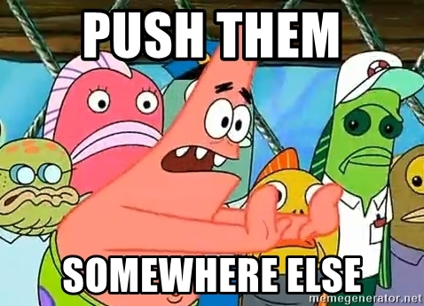

import Link from '@docusaurus/Link';

export function Tiny({children}) {
  return <span style={{fontSize: '0.75em'}}>{children}</span>;
}

Introducing flecks: an **exceptionally-extensible application production system**.

{/* truncate */}

## First off, :pray:

I appreciate you checking out the project! I truly hope that you will find working with flecks
to be a joy. Feedback is welcome over on the
[Github discussions page](https://github.com/cha0s/flecks/discussions) or the
[Discord](https://discord.gg/SH66yQBwNf)!

:::warning[What's the letter before "alpha"?]

This is a new release and worked on by only one person: [me](https://github.com/cha0s)! Please
keep this in mind!

:::

## Is it ~~webscale~~ fullstack?

<figure>
  
  <figcaption style={{fontSize: '0.8rem'}}>*yes, I remember*</figcaption>
</figure>

I admit, I baited with the title there just a little bit. I love fullstack! flecks is more
than capable of building fullstack applications. If you just want to jump to more of that sort
of thing, you might be interested in the <Link target="_blank" to="https://cha0s.github.io/flecks/docs/react">React</Link>
page in the documentation.

### For real, though

A fullstack JS application is basically appception: what you actually have is a server
application written in JS that serves a client application written in JS. Using
the same language obscures (arguably, *by design*) the fact that these are actually two distinct
applications.


:::danger[`'use controversy';`]

Some modern framework APIs are becoming increasingly esoteric in their attempt to paper over
this reality
([*\*ahem\**](https://github.com/cha0s/flecks/blob/master/packages/react/src/client.js#L24)... and
don't get me started on [**RSC**](https://www.mayank.co/blog/react-server-components/)...).

:::

### Don't get it twisted

To put it in basic terms: A web server is a core aspect of a fullstack application, but **a
web server is not a core aspect of an application**. The same could be said about asset
optimization, routing, and many other core fullstack JS concepts.

flecks is concerned with **writing applications**; fullstack applications are merely a subset of
that.

## Do one thing and do it well

The core primitive is the **fleck** which is... just a JS module. There exists a server
fleck, a web fleck, a React fleck, and so on.

Here's a simple fleck that says hello when the application is starting:

```js
export const hooks = {
  '@flecks/core.starting': () => {
    console.log('hey you');
  },
};
```

That's it. It's a module that exports some hook implementations. If you're curious what kind of
hooks we're talking about, check out
<Link target="_blank" to="https://cha0s.github.io/flecks/docs/flecks/hooks">the hooks reference page</Link>.

You add a reference to your fleck to a file called
<Link target="_blank" to="https://cha0s.github.io/flecks/docs/creating-a-fleck">`flecks.yml`</Link>
and you're rolling. Use the
[built-in tooling](https://cha0s.github.io/flecks/docs/creating-a-fleck) and you won't even have
to do that by hand. Again, **a flecks application is just flecks** having their hook
implementations invoked.

What are multiple flecks called? **flecks**!

:::tip[Flickin' fleckers]

It is not a coincidence that the name of the framework uses the same word as the plural form of
its constituting elements: the implication is that **flecks is just flecks**, it's not really doing
anything special on its own. Sure, it *does something*, but the something that it does is provide
tools with which to orchestrate your flecks together into an application.

:::

### Small core

Creating an application with `@flecks/create-app` and then doing
e.g. `yarn install --production` will result in a full working application with a size of
**less than 7 MB**. Granted, it's only a server that will start, have nothing to do, and halt in
about 100 ms, but it illustrates that flecks builds what you tell it to, **it is not a kitchen
sink system**.

<figure>
  
  <figcaption style={{fontSize: '0.8rem'}}>*When you're writing an article and curious about how the Big Kid on the Block performs in terms of raw default production application size, but can't even figure out how to measure it because you have already downloaded more than 7MB of ads for their "hosting solution" into your brain in the process*</figcaption>
</figure>

### So where's asset optimization, data fetching, filetree routing, RSC...?

Well, I do admit that I don't stand before you today with a solution for every problem around
fullstack development.

flecks is made with **cooperation and collaboration as a primary concern**. A fleck is *just
a package* exactly for that reason: it should be frictionless to publish a package (or a suite)
to the world and then add them to a project just like you would with any other package! **It should
be as frictionless** for a developer to say "I don't agree with how this fleck is
implemented" and write their own, interacting seamlessly with everything else they actually want.

**I believe we can design modular solutions to these problems!** In order to do this, it's probably
better to be standing on top of less, not more.

### <ins>Better *no* abstraction than the *wrong* abstraction</ins>

I know this will come off as inflammatory but some of the more recent JS framework "paradigms" feel
like someone <Tiny><Tiny>drunk-</Tiny></Tiny>coded at midnight and *had an epiphany* about the "killer new
thing" which means they are now going to spend the next 5 hours torturing their code only to wake
up the next morning absolutely exhausted with a rickety codebase and a deep sense of regret as they
revert all the changes and pretend that it never happened.

<figure>
  
  <figcaption style={{fontSize: '0.8rem'}}>***obviously** this has never happened in **my** projects. <Tiny><Tiny>Also, I ran your credit card the whole time.</Tiny></Tiny>*</figcaption>
</figure>

### The flecks way

The few core architectural opinions that are held are presented as suggestions, not requirements.

:::info[**“I hold it to be the inalienable right of anybody to go to hell in his own way.”**]

― Robert Frost

:::

A few motivating philosophies which I **do not** consider to be suggestions regarding this
project:

- You **shouldn't be unpleasantly surprised** by what happens
- Your application has what **you** want in it, not what **flecks** wants in it
- Developer **comfort and confidence are essential**, not just a nice-to-have
- You **shouldn't have to have a full budget** for production deployment
- Core architectural **opinions require transparency and justification**

## Why though?

You might be thinking something like:

<figure>
  
  <figcaption style={{fontSize: '0.8rem'}}>***Why?!*** *A new JavaScript framework is the last thing we need.*</figcaption>
</figure>

Perhaps you will write a thesis explaining in great detail why there is no
objective reason for flecks to exist. **I'm fine with that**,
<Tiny>because I love it and there's nothing you can do about it.</Tiny>

Seriously though, a couple reasons why I made flecks and use it to develop applications are:

### Separation of concerns

JS has matured a lot over the years, and modules are all but a first-class concept. This has been
a huge win for Properly Structured™ applications.

However, I believe the real reason many fullstack frameworks exist today is to
*centralize concerns*. No one wants to set up a whole database, a routing system, a webserver,
etc, <Tiny>etc, <Tiny>etc.</Tiny></Tiny> every time. So, the default approach has been to reach out
for a framework to tie it all together. To some extent this is an inevitable evolution.

<figure>
  
  <figcaption style={{fontSize: '0.8rem'}}>*You've never even **seen** a real <Link target="_blank" to="https://cha0s.github.io/flecks/docs/redux">duck</Link>*</figcaption>
</figure>


With flecks, the first principle is to push these concerns out into modular units which do one
thing and do it immaculately.
[This is not a new concept](https://en.wikipedia.org/wiki/Unix_philosophy)! These units can be
composed into an application that does as much or as little as you like, <Tiny>without requiring
your application structure to follow some corporate diktat <Tiny>requiring you to enter a mailing
address to submit a pull request. <Tiny>(don't ask...)</Tiny></Tiny></Tiny>

### Joy

<div style={{float: 'right', padding: '0 1.5rem'}}></div>

I have found this structure to work very well and to *feel pleasant*. It's great to get up and
running super quickly without having to repeat a monolithic structure over and over. It's almost
reminiscent of those small plastic building blocks my parents used to step on. Super fun!

I find that I **don't have to think about what flecks is doing** most of the time, which is exactly
what I want.

flecks is at its best when you can forget that it exists and everything Just Works™.

### I miss old React

One of the reasons I started using React over a decade ago was because it didn't try to dictate
every aspect of how my application was built. This new-fangled server renderin' ain't new for me
either.
[Not me casually dropping a link showing that I was messing with **SSRing Angular 1 back in 2013**](https://github.com/cha0s/shrub/commit/7573da0011cb518af460c8ef305c226144ab9603#diff-478e94fcfb7f124ddcb4782ba905316bdeac63aefc6167be56cf22829677c3bdR19).

Maybe it's irresponsible, maybe it's freewheeling (and yes, flecks (and everything) should have
more tests) but I miss that old spirit and flecks is in some small way an homage to a Better
Time™.

### Because I can

No, seriously! Over the years interacting with various parts of the JS ecosystem I have experienced
a few fairly hostile encounters with closed-minded people who lacked the imagination to see beyond
the established wisdom of the week.

So I guess anyone who told me that it won't work, doesn't make sense, or other copium-based
responses: Here it is! Eat your hearts out and
<span className="getmemedon">**haterz get meme'd on**</span>. :nail_care:

## Thanks again

I do appreciate you reading all that! I apologize if my tone came off as overly-antagonistic (as
opposed to <em>the-correct-amount-of-</em>antagonistic). I actually think people are *afraid* to say some
of the things I've said here out loud! Come send me love (or threats or whatever) at the
[Github discussions page](https://github.com/cha0s/flecks/discussions) or the
[Discord](https://discord.gg/SH66yQBwNf)!

Most importantly: **Have fun**! :heart:
