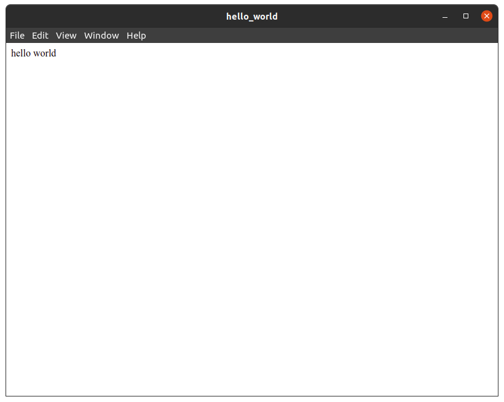

import Execute from '@site/helpers/execute';
import Install from '@site/helpers/install-package';
import Run from '@site/helpers/run';

# Adding flecks

`@flecks/web` is a fleck that builds and serves a webpage. You can add it to your application
using the CLI:

<Execute cmd="flecks add @flecks/web" />

:::danger[Fast and dynamic]

If your application was still running when you added that fleck, you will see the application
automatically restart!

:::

Otherwise, if you run:

<Run headless cmd="start" />

you'll see a line in the output:

```
  @flecks/web/server/http HTTP server up @ 0.0.0.0:32340!
```

## Finally... a white page?

If you visit `localhost:32340` in your browser, you should now see... a blank white page! Don't fret
though; if you open the devtools in your browser, you will see a little messaging from your
application that will look something like:

```
[webpack-dev-server] Server started: Hot Module Replacement enabled, Live Reloading enabled, Progress disabled, Overlay enabled.
[HMR] Waiting for update signal from WDS...
flecks client v3.1.5 loading runtime...
```

This is a good sign! This means we successfully added a web server with HMR enabled by default.
Oh, the possibilities...

## Proceed with the hooking

Let's make our fleck `say-hello` hook into `@flecks/web` client to do something when the client
comes up (e.g. the browser loads the page).

```javascript title="packages/say-hello/src/index.js"
export const hooks = {
  // highlight-start
  '@flecks/web/client.up': async (container) => {
    container.append('hello world');
  },
  // highlight-end
  '@flecks/server.up': async (flecks) => {
    const {id} = flecks.get('@flecks/core');
    process.stdout.write(`  hello server: ID ${id}\n`);
  },
};
```

:::danger[And another one]

Just like before, saving that file will automatically reload your webpage and show you the message
immediately!

:::


Glorious, isn't it?


## Everything so far... plus Electron!

Let's add another core fleck. flecks ships with a core fleck `@flecks/electron`. This runs your
application inside of an instance of [Electron](https://www.electronjs.org/). You'll add the fleck:

<Execute headless cmd="flecks add -d @flecks/electron" />

You will almost immediately see something like this:



Isn't it beautiful? :relieved:

:::note

We used the `-d` option with `flecks add` to add `@flecks/electron` to
[`devDependencies`](https://docs.npmjs.com/specifying-dependencies-and-devdependencies-in-a-package-json-file)
since it's only needed for development.

:::

Next, we'll go over some of the nuts and bolts of how your application is built.

This is test text.
