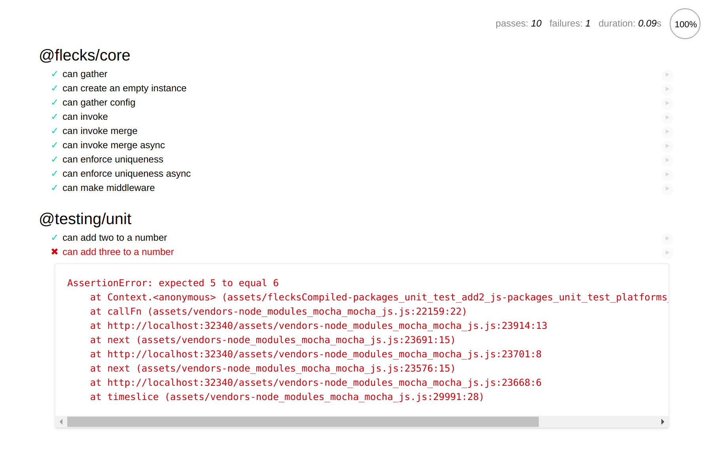
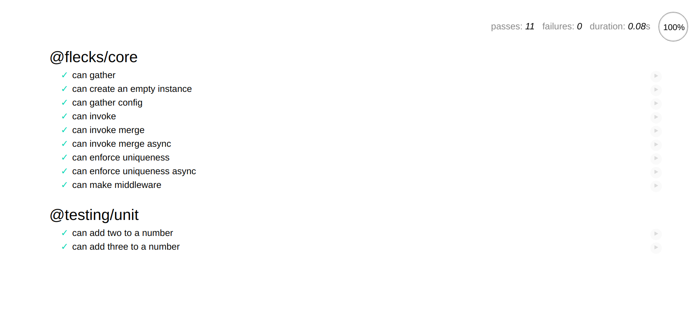

Using `@flecks/create-fleck` sets up an environment to build

## `package.json` and entry points

flecks automatically uses the `files` key in your `package.json` to determine the
[entry points](https://webpack.js.org/concepts/entry-points/) of your fleck. Entry points are
automatically discovered from the **`src`** directory of your fleck.

Think of your `files` key as a sort of `exports`, but for your files. If your `package.json`'s
`files` key looks like this:

```json
  "files": [
    "client.js",
    "index.js",
    "something-else.js"
  ],
```

Other code could `import` any of those paths (e.g. `@your/fleck/client`, `@your/fleck`,
`@your/fleck/something-else`).

You may have a structure like `src/client/index.js` and the entry point discovery would still
work as expected above.

### Who cares? Everything works without it!

Who cares about exporting, though? I created a fleck and everything Just Works:tm:. This
seems like extra busywork for no reason!

:::tip[Sharing is caring]

The reason we take care of the `files` key in our `package.json` is because **this
is how we make sure we can publish working flecks to `npm`**! this tooling is directed toward
making it easier and frictionless to share code.

:::

### Processing `package.json`

flecks augments your source `package.json` during the build process and outputs a
**built `package.json`** to **`dist`**.

If you generate a fleck using `create-fleck`, its `files` key will look like this:

```json
  "files": [
    "index.js"
  ],
```

flecks automatically adds some paths to the `files` key of your built `package.json`:

- `build` directory
- `src` directory (if sources exist)
- **sourcemaps** for each entry point (e.g. `index.js` -> `index.js.map`)
- `test` directory (if tests exist)

:::info[Hook that one, too]

`@flecks/fleck` invokes a hook
[`@flecks/fleck.packageJson`](./flecks/hooks#flecksfleckpackagejson) which exposes this for any
other fleck to process `package.json` when building a fleck.

For instance, `@flecks/web` implements this hook. `@flecks/web` will automatically output
CSS, fonts, and other frontend assets to the `assets` directory in your build output. If any of
these frontend assets exist, `@flecks/web` will automatically add the `assets` directory to the
`files` key of your built `package.json`. You don't have to think about it!

:::

:::warning[Normal distribution]

What this means is that when we publish a fleck we don't publish the root directory, **we publish
the `dist` output directory**.

The same applies when [symlinking your fleck](./building-your-application#symlinks) in an
application.

:::

## webpack build configuration

### `build/fleck.webpack.config.js`

flecks provides a default webpack configuration for your fleck. This may not be what you want, so
you may override it:

```js title="build/default.eslint.config"
const flecksWebpackDefaults = require('@flecks/fleck/build/fleck.webpack.config');
module.exports = async (env, argv, flecks) => {
  const config = await flecksWebpackDefaults(env, argv, flecks);
  // ...
  return config;
};
```

You don't actually have to extend the configuration like that, you could return your own! That's
just an illustration of how you can override the defaults.

That being said, the defaults (including the automatic entry point stuff above and so much more)
will absolutely make your life easier.

## Testing

flecks uses Mocha and Chai to run your tests. When you create a fleck, it includes a run script
`test`. If you run it in your new empty fleck, you will see the output:

```
No fleck tests found.
```

No tests exist by default. Let's look at some example code and tests to understand how it works.

### Example source

```javascript title="packages/example/src/index.js"
export const add2 = (n) => n + 2;

export const add3 = (n) => n + 3;
```

### Example test

```javascript title="packages/example/test/add2.js"
import {expect} from 'chai';

const {add2} = require('@testing/unit');

it('can add two to a number', () => {
  // highlight-next-line
  expect(add2(2)).to.equal(5);
});
```

:::note

We intentionally made an error so we can see what a failed test looks like.

:::

If we run the following command **from within `packages/example`**:

```bash
npm run test
```

We would see the following output:

```
  1) can add two to a number

  0 passing (11ms)
  1 failing

  1) can add two to a number:

      AssertionError: expected 4 to equal 5
      + expected - actual

      -4
      +5
```

It catches the error! If we fixed it:

```javascript title="packages/example/test/add2.js"
import {expect} from 'chai';

const {add2} = require('@testing/unit');

it('can add two to a number', () => {
  // highlight-next-line
  expect(add2(2)).to.equal(4);
});
```

and try again:

```bash
npm run test
```

```
  ✓ can add two to a number

  1 passing (4ms)
```

Everything's good!

### Platform-specificity

flecks also allows you to write tests that only target a specific platform. Let's add web support
and then write a test that only runs for the client:

```bash
npx flecks add @flecks/web
```

Now, let's add a test. We add a client test by adding a `client` directory to our `test`
directory and putting tests there:

```javascript title="packages/example/test/client/add3.js"
import {expect} from 'chai';

const {add3} = require('@testing/unit');

it('can add three to a number', () => {
  // highlight-next-line
  expect(add3(2)).to.equal(6);
});
```

:::note

We intentionally made a mistake again to show a test failure.

:::

#### Check it

Start your application, visit your website in the browser, and you will see:



The test is failing! That's what we expected.

Now, edit your client test to fix it:

```javascript title="packages/unit/test/client/add3.js"
import {expect} from 'chai';

const {add3} = require('@testing/unit');

it('can add three to a number', () => {
  // highlight-next-line
  expect(add3(2)).to.equal(5);
});
```

Save the file. If you still have your application running, go look at the page. You'll notice that
**it updated automatically** to look like:



Awesome, everything passes!

:::info[Sanity check]

If you run `npm run test` in your `packages/example` directory, you will see that only one test was
run:

```
  ✓ can add two to a number

  1 passing (3ms)
```

That's correct; we only run client tests on the client.

:::

## Linting

flecks automatically includes support for ESLint through a `lint` run script. flecks configures a
lot of default rules including a lightly-tweaked version of
[`eslint-config-airbnb`](https://airbnb.io/javascript/) as well as overrides for special
circumstances: for instance, loosening some rules for the `test` directory.

### `build/default.eslint.config`

You may want to completely change these defaults and you can do so by creating a file
`build/default.eslint.config`:

```js title="build/default.eslint.config"
const flecksEslintDefaults = require('@flecks/build/build/default.eslint.config');
module.exports = async (flecks) => ({
  extends: [
    await flecksEslintDefaults(flecks),
  ],
  // ...
});
```

Again, you don't actually have to extend the configuration like that, you could return your own!

:::info[Wait a minute, is that asynchronous ESLint configuration?]

ESLint has made \**async noises*\* lately, but as of this writing, the actually-working version requires
you to write synchronous configuration files. *So how does flecks do it*? Honestly?
[Don't ask...](https://github.com/cha0s/flecks/blob/master/packages/build/build/eslint.config.js)
We interface with torturous APIs so you don't have to!

:::
