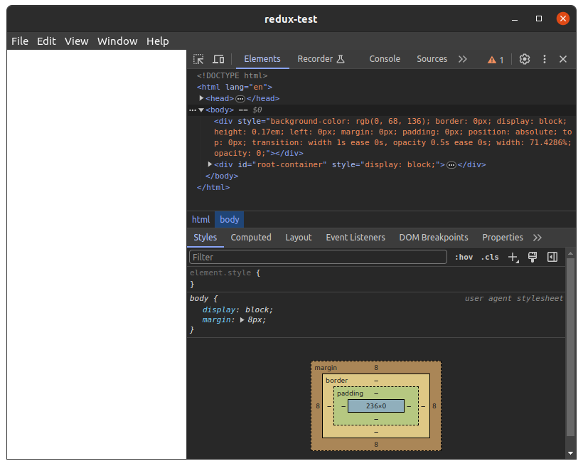
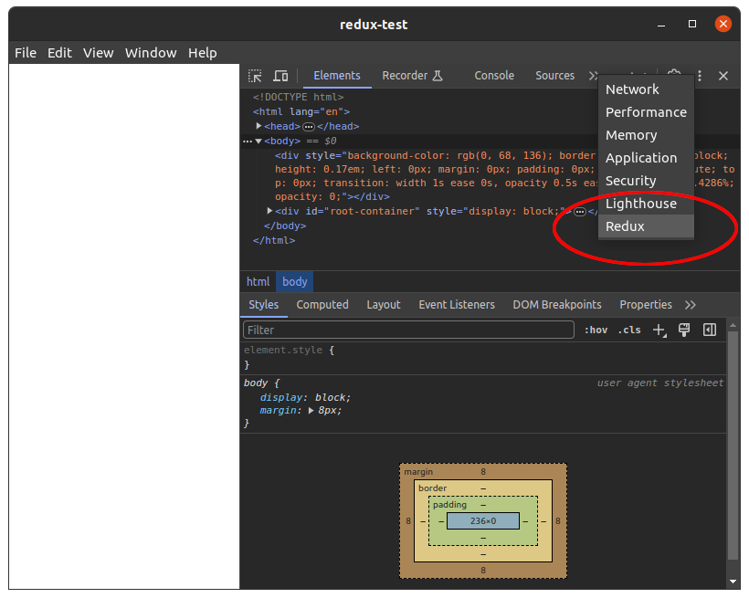
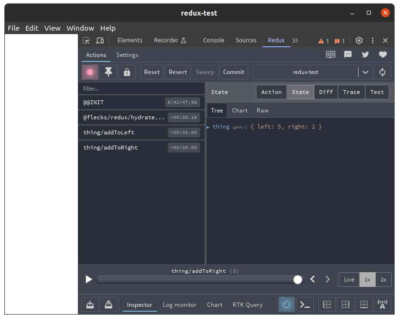
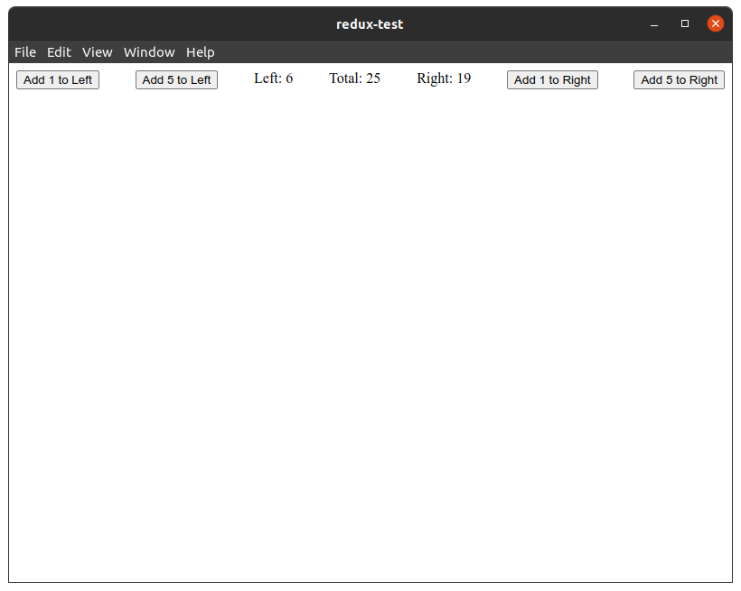

import Create from '@site/helpers/create';
import InstallPackage from '@site/helpers/install-package';

Working with redux in flecks is easy. Let's create a small application to inspect and
familiarize ourselves.

## Create an app

<Create type="app" pkg="redux-test" />

```
cd redux-test
```

## Create a fleck

<Create type="fleck" pkg="ducks" />

We'll add the `redux` fleck to our new fleck:

```
cd packages/ducks
npx flecks add @flecks/redux
```

Alright, let's create a duck at `packages/ducks/src/state/thing.js`:

```js title="packages/ducks/src/state/thing.js"
import {
  createSelector,
  createSlice,
} from '@flecks/redux';

export const thingSelector = ({thing}) => thing;

export const leftSelector = createSelector([thingSelector], ({left}) => left);

export const rightSelector = createSelector([thingSelector], ({right}) => right);

export const totalSelector = createSelector(
  [leftSelector, rightSelector],
  (left, right) => left + right,
);

export const initialState = () => ({
  left: 0,
  right: 0,
});

const reducers = {
  addToLeft: (state, {payload}) => {
    state.left += payload;
  },
  addToRight: (state, {payload}) => {
    state.right += payload;
  },
};

const slice = createSlice({
  name: 'thing',
  initialState: initialState(),
  reducers,
});

export const {
  addToLeft,
  addToRight,
} = slice.actions;

export default slice.reducer;
```

Let's create an exporter at `packages/ducks/src/state/index.js`:

```js title="packages/ducks/src/state/index.js"
export * from './thing';
export {default as thing} from './thing';
```

Finally, we'll edit `packages/ducks/src/index.js`:

```js title="packages/ducks/src/index.js"
import {Flecks} from '@flecks/core';

import {addToLeft, addToRight, thing} from './state';

export const hooks = {
  '@flecks/web/client.up': Flecks.priority(
    async (flecks) => {
      flecks.redux.dispatch(addToLeft(5));
      flecks.redux.dispatch(addToRight(2));
    },
    {after: '@flecks/redux/client'},
  ),
  '@flecks/redux.slices': () => ({thing}),
};
```

:::note[Have a slice]

We're using `@flecks/web/client.up` just as a little test.

:::

As a little test, we'll add `@flecks/web` and `@flecks/electron` so we can check out the Redux
devtools.

From the project root:

```
npx flecks add @flecks/web
npx flecks add -d @flecks/electron
```

:::warning[Attention]

Those commands should be run **in the application root directory**! Your fleck doesn't care about
dealing with a web server or an electron app.

:::

Now start up your application:

```
npm start
```

After a moment, Electron will appear. Press `ctrl+i` to open devtools in Electron.



Open up the Redux devtools:



Everything is there!



How about Redux in React? No problem! Move to `packages/ducks` and run the following command:

```
npx flecks add @flecks/react-redux
```

:::warning[Attention]

That command should be run **in `packages/ducks`**! This way, the fleck encapsulates all of its
dependencies. Your fleck is its own package. If you do things right, you can even publish your
fleck for others to use!

:::

Let's create a component at `packages/ducks/src/thing.jsx`:

```jsx title="packages/ducks/src/thing.jsx"
import {React} from '@flecks/react';
import {useDispatch, useSelector} from '@flecks/react-redux';

import {
  addToLeft,
  addToRight,
  leftSelector,
  rightSelector,
  totalSelector,
} from './state';

function Thing() {
  const dispatch = useDispatch();
  const left = useSelector(leftSelector);
  const right = useSelector(rightSelector);
  const total = useSelector(totalSelector);
  return (
    <div style={{display: 'flex', justifyContent: 'space-between'}}>
      <button onClick={() => dispatch(addToLeft(1))}>Add 1 to Left</button>
      <button onClick={() => dispatch(addToLeft(5))}>Add 5 to Left</button>
      <span>Left: {left}</span>
      <span>Total: {total}</span>
      <span>Right: {right}</span>
      <button onClick={() => dispatch(addToRight(1))}>Add 1 to Right</button>
      <button onClick={() => dispatch(addToRight(5))}>Add 5 to Right</button>
    </div>
  )
}

export default Thing;
```

Now update `packages/ducks/src/index.js`:

```js title="packages/ducks/src/index.js"
import {thing} from './state';
import Thing from './thing';

export const hooks = {
  '@flecks/react.roots': () => Thing,
  '@flecks/redux.slices': () => ({thing}),
};
```

Restart your application. It works!


