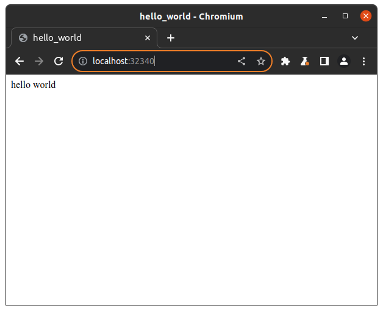
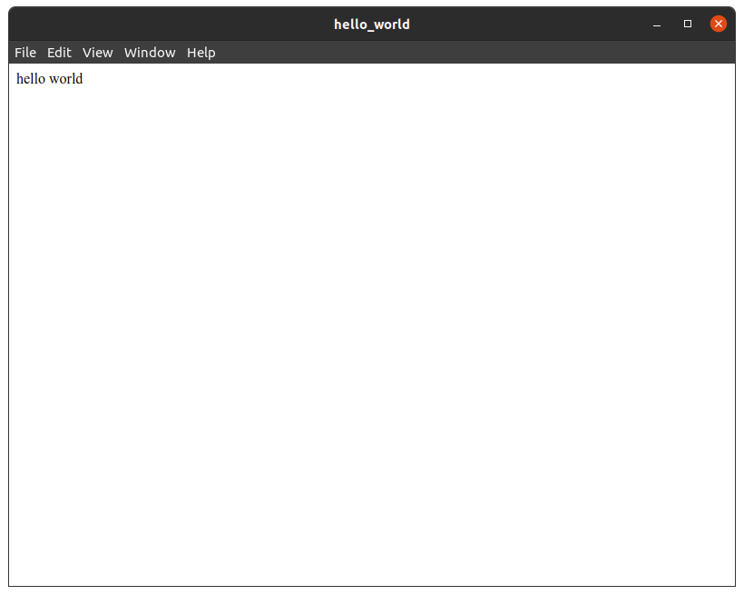

# Adding flecks

`@flecks/web` is a fleck that builds and serves a webpage. You can add it to your application
using the CLI:

```bash
npx flecks add @flecks/web
```

Now, if you run `npm start`, you'll see a line in the output:

```
  @flecks/web/server/http HTTP server up @ 0.0.0.0:32340!
```

## Finally... a white page?

If you visit `localhost:32340` in your browser, you should now see... a blank white page! Don't fret
though; if you open the devtools in your browser, you will see a little messaging from your
application that will look something like:

```
[webpack-dev-server] Server started: Hot Module Replacement enabled, Live Reloading enabled, Progress disabled, Overlay enabled.
[HMR] Waiting for update signal from WDS...
flecks client v2.0.3 loading runtime...
```

This is a good sign! This means we successfully added a web server with HMR enabled by default.
Oh, the possibilities...

## Proceed with the hooking

Let's make our fleck `say-hello` hook into `@flecks/web` client to do something when the client
comes up (e.g. the browser loads the page).

```javascript title="packages/say-hello/src/index.js"
export const hooks = {
  // highlight-start
  '@flecks/web/client.up': async () => {
    window.document.body.append('hello world');
  },
  // highlight-end
  '@flecks/server.up': async (flecks) => {
    const {id} = flecks.get('@flecks/core');
    process.stdout.write(`  hello server: ID ${id}\n`);
  },
};
```

Now, restart your application and refresh your website. Glorious, isn't it?



## Everything so far... plus Electron!

Let's add another core fleck. flecks ships with a core fleck `@flecks/electron`. This runs your
application inside of an instance of [Electron](https://www.electronjs.org/). You'll add the fleck:

```bash
npx flecks add @flecks/electron
```

Then you'll update your `build/flecks.yml` like so:

```yml
'@flecks/core':
  id: 'hello-world'
'@flecks/electron': {}
// highlight-start
'@flecks/server':
  up:
    - '...'
    - '@flecks/web'
    - '@flecks/electron'
// highlight-end
'@flecks/web': {}
'@hello-world/say-hello:./packages/say-hello/src': {}
```

### ~~flecking~~ pecking order

We added some configuration to `@flecks/server`. The `up` key configures the order in which flecks
are initialized when the server comes up. We make sure `@flecks/web` serves a webpage before
`@flecks/electron` tries to visit it.

:::tip[...and Bob's your uncle]

`'...'` just means "everything else": if any other flecks implement that hook then they will run
here in an **undefined** order. It is valid to provide entries both before and after `'...'`, but
`'...'` must only appear one time per list.

The default configuration of
`@flecks/server.up` is simply:

```yml
'@flecks/server':
  up:
    - '...'
```

However in this case the order of hook execution is undefined. That's why we configure it
explicitly.

:::

Finally `npm start` and you will see something like this:



Isn't it beautiful? :relieved:
