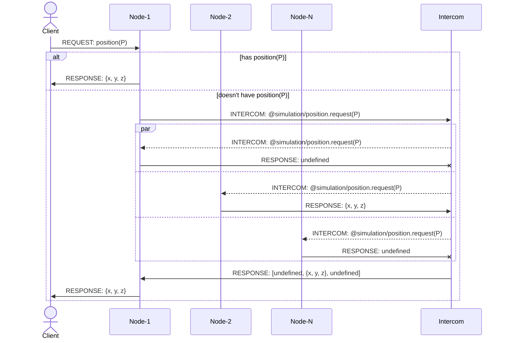

import Tabs from '@theme/Tabs';
import TabItem from '@theme/TabItem';

# Sockets

flecks provides real-time socket connections through [Socket.IO](https://socket.io/docs/v4/).
Packets are binary by default so they are small and fast.

## Packets

```javascript title="packages/example/src/index.js"
import {Flecks} from '@flecks/core/server';

export const hooks = {
  '@flecks/socket.packets': Flecks.provide(require.context('./packets')),
}
```

The simplest packet can be defined like so:

```javascript title="packages/example/src/packets/slap.js"
export default (flecks) => {
  const {Packet} = flecks.fleck('@flecks/socket');
  return class Slap extends Packet {};
};
```

This transmits no packet data at all, only the packet ID. e.g., you just know you've been
slapped, since it's a slap packet. You don't know why, how hard, etc.

This is a **long-winded way** of sending a packet:

```javascript
const {Slap} = flecks.socket.Packets;
socket.send(new Slap());
```

but let's learn about **packet hydration** to make working with packets a lot easier.

### Packet hydration

Instead of getting the packet class and having to manually create a new packet to send every time,
we can instead send a **dehydrated packet**:

```javascript
socket.send(['Slap']);
```

Notice that **a dehydrated packet is an array**. The first element of the array is the
[gathered name](./gathering) of the packet.

:::tip[Move the payload!]

The second element is the `data` passed to the packet constructor. We'll see a couple more
examples of sending dehydrated packets on this page to come.

:::

Dehydrated sending is *just better* and should always be preferred!

### SchemaPack

Packets may implement a static getter method `data` to define the schema with which to serialize the
packet data. See [SchemaPack](https://github.com/phretaddin/schemapack)
to learn more.

#### Data types

| Type Name | Bytes                                                                                                                                                         | Range of Values                 |
|-----------|---------------------------------------------------------------------------------------------------------------------------------------------------------------|---------------------------------|
| bool      | 1                                                                                                                                                             | `true` or `false`               |
| int8      | 1                                                                                                                                                             | -128 to 127                     |
| uint8     | 1                                                                                                                                                             | 0 to 255                        |
| int16     | 2                                                                                                                                                             | -32,768 to 32,767               |
| uint16    | 2                                                                                                                                                             | 0 to 65,535                     |
| int32     | 4                                                                                                                                                             | -2,147,483,648 to 2,147,483,647 |
| uint32    | 4                                                                                                                                                             | 0 to 4,294,967,295              |
| float32   | 4                                                                                                                                                             | 3.4E +/- 38 (7 digits)          |
| float64   | 8                                                                                                                                                             | 1.7E +/- 308 (15 digits)        |
| string    | varuint length prefix followed by bytes of each character                                                                                                     | Any string                      |
| varuint   | 1 byte when 0 to 127<br /> 2 bytes when 128 to 16,383<br /> 3 bytes when 16,384 to 2,097,151<br /> 4 bytes when 2,097,152 to 268,435,455<br /> etc.           | 0 to 2,147,483,647              |
| varint    | 1 byte when -64 to 63<br /> 2 bytes when -8,192 to 8,191<br /> 3 bytes when -1,048,576 to 1,048,575<br /> 4 bytes when -134,217,728 to 134,217,727<br /> etc. | -1,073,741,824 to 1,073,741,823 |
| buffer    | varuint length prefix followed by bytes of buffer                                                                                                             | Any buffer                      |

### Packer

`Packer` is a higher-order function that may be used to pack all or part of the packet data
regardless of the schema (e.g. JSON). `Packer` uses
[`msgpack-lite`](https://github.com/kawanet/msgpack-lite) to serialize the packet data.

#### The entire packet

```javascript title="packages/example/src/packets/anything.js"
export default (flecks) => {
  const {Packer, Packet} = flecks.fleck('@flecks/socket');
  const decorator = Packer();
  return class Anything extends decorator(Packet) {};
};
```

```javascript
socket.send(['Anything', {foo: 'bar', arbitrary: 'data'}]);
```

#### A specific key

```javascript title="packages/example/src/packets/anything-field.js"
export default (flecks) => {
  const {Packer, Packet} = flecks.fleck('@flecks/socket');
  const decorator = Packer('document');
  return class AnythingField extends decorator(Packet) {

    // Notice that we may still define other data fields here.
    static get data() {
      return {
        id: 'uint32',
      };
    }

  };
};
```

```javascript
socket.send([
  'AnythingField',
  {
    document: {whatever: 'you', want: 42},
    id: 1234567,
  },
]);
```

Packers ultimately pack to/from binary and are compiled down to the `buffer` data type in the
schema.

### Bundles

A bundle is a bunch of packets that get packed into a single packet. Before you ask, **yes**, you can
create `Bundle`s of `Bundle`s of packets. They're recursive!

```javascript
const packets = [
  ['Action', {type: 'SET', payload: 20}],
  ['Bundle', [
    ['Action', {type: 'ADD', payload: 23}],
    ['Action', {type: 'ADD', payload: 26}],
  ]],
  // ...
];
socket.send(['Bundle', packets]); // Nice.
```

Bundles ultimately pack to/from binary and are compiled down to the `buffer` data type in the
schema.

### Acceptors

Packets are subject to acceptors which validate and respond to packets. Your packets may implement
acceptor methods:

#### `validate(packet, socket)`

##### `packet`

The packet being validated.

##### `socket`

The socket through which was sent the packet being validated.

`validate` acceptor methods may throw `ValidationError`s which `@flecks/socket` provides:

```javascript title="src/packets/some-packet.js"
export default (flecks) => {
  const {Packet, ValidationError} = flecks.fleck('@flecks/socket');

  return class SomePacket extends Packet {

    static async validate(packet, {req}) {
      if (await req.checkSomething()) {
        throw new ValidationError({code: 404, reason: 'no something found'});
      }
    }

  };
};
```

#### `respond(packet, socket)`

##### `packet`

The packet being responded to.

##### `socket`

The socket through which was sent the packet being responded to.

:::note[Full circle]

The result from your `respond` acceptor method is serialized and transmitted and is ultimately the
result of socket.send`:

```javascript
const result = await socket.send(['Whatever']);
// result is whatever was returned from the `respond` acceptor method.
```

:::

#### Examples

- The `@flecks/redux` client implements the following `respond` acceptor method:

  ```javascript
    static async respond(packet) {
      flecks.redux.dispatch(packet.data);
    }
  ```

  Whenever the client receives an `Action` packet, the action will be dispatched by
  the redux store.

- `@flecks/passport` implements a `validate` acceptor method for the `Logout` packet:

  ```javascript
      static validate(packet, {req}) {
        if (!req.user) {
          throw new ValidationError({code: 400, reason: 'anonymous'});
        }
      }
  ```

  If `req.user` doesn't exist, the packet fails validation.

## Intercom

flecks provides **intercom** as a way for your socket server nodes to communicate amongst
themselves. Intercom is provided on a server socket at `socket.req.intercom` and has two
parameters:

### `type`

The type of intercom call to make (e.g. `@flecks/passport.users`).

### `data`

Arbitrary serializable data to send along with the intercom request.

:::tip[Putting the web in websockets]

Intercom can also be called from an implementation of `@flecks/web/server.request.socket` through
`req.intercom`.

:::

### Motivation

Suppose that we are running many game simulation nodes which each have many clients connected. The
nodes are processing a large number of positions in real time. Clients connected to any
node must be able to request a position even if it is simulated on another node. A client connected
to a node may request a position `P`. A node may efficiently check if it simulates `P`.

If the node that dispatches the request simulates the position, the response can be instant.
Otherwise, the node must use **intercom** to ask the other nodes whether they simulate `P`:

```javascript
const responses = await socket.req.intercom('@simulation/position.request', P);
```

This asks the other nodes if they simulate `P`. Nodes will respond either with `undefined` or `P`
through their implementations of `@flecks/socket.intercom`:

```javascript
export const hooks = {
  '@flecks/socket.intercom': async (P, {simulation}) => {
    if (simulation.has(P)) {
      return simulation.positionOf(P);
    }
    // return undefined is implied...
  },
}
```

:::note[Is that really what I sound like?]

Intercom **will** invoke the `@flecks/socket.intercom` implementation of the requesting node, not
only the others.

:::

### Diagram



## Default packets

`@flecks/socket` provides some packets by default:

### `Refresh`

Sent to a client, refreshes the page.

```javascript
socket.send(['Refresh']);
```

### `Redirect`

Send a string which will be assigned to `window.location.href`.

```javascript
socket.send(['Redirect', '/']);
```

See [the generated hooks page](./flecks/hooks#fleckssocketpackets) for an exhaustive list of packets.
